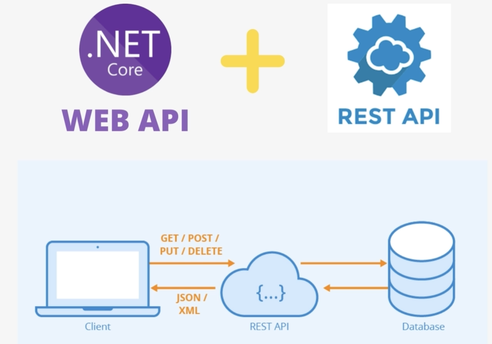

# ✨ Build ASP.NET Core Web API - Scratch to Finish (.Net8 API)

Vamos usar a API para realizar outras operações, como criar, atualizar excluir.
Começaremos nosso curso entendendo os princípios do Rest, criaremos e entenderemos os novo projeto.

## 📍 Objetivo 
- Create and Understand NEW ASP.NET Core Web APi Project.
- Aprenderemos e usaremos a estrutura de entidade para conversar com nosso banco de dados do SQL Server.
- Entity Frameword Cre + Microsoft SQL Server

Eu lhe dou as boas-vindas ao curso, no qual você aprenderá e dominará seu ESP e suas principais habilidades, ASP.NET Core Web API.
(.NET Core).

- Você irá criar uma API spider web altamente dimensionável do zero. 
- Junto criaremos uma API que meus clientes poderão consumir nessa API. 
- Seguiremos os padroes RESTFUl e criaremos uma API NZ walks.

  
  
- Essa API conterá informações sobre as regiões e caminhadas da Nova Zelândia. Também usaremos essa API para realizar outras operações, como create, read, update e delte **(CRUD)**
- Vamos começar com a criação e entendimento no **New ASP.NET CORE WEB API Project**. 
- Aprenderemos a usar a estrutura de entidade para conversar com nosso banco de dados do SQL Server. 
- Em seguida criaremos nossos controladores de API e entenderemos o conceito de domímio e detalhes (**DTO**). 
- Instalar o SQL Server e também instalaremos SQL Server Management Studio

**Dicas**: 
Para você realizar o curso você precisa: 
- Ter pelo menos três meses de experiência trabalhando com CSharp e ASP.Net Core ou ASP, Net MVC. 
- Saiba o que são APIs e porque a criamos 
- Entendimento do .Net. 

## Introdução 
- Create New Web API
  - Nessa seção, criaremos um novo ASP .NET Core API do zero
- Understand File e Folder Structure
  - Entenderemos os arquivos e as pastas que o folder nos forneceu
- Understand REST Principles and HTTP Verbs 
  - Em seguida, entenderemos os princípios REST e os verbos HTTP comuns
- Routing in ASP.NET Core Web APIs 
  - Examinaremos o roteamento em nossa API da Web 
- Running and Comuming our API 
  - Em seguida, veremos como podemos executar e consumir nossa API usando SWAGGER e postman
- Creating Our Project Domain Models
  - Também começaremos nosso trabalho nessa API criando os modelos de domínio para nosso projeto
- Learning & Using Entity Framework 
  - Por fim, entenderemos, instalaremos e usaremos o núcleo da estrutura de entidade em nosso projeto